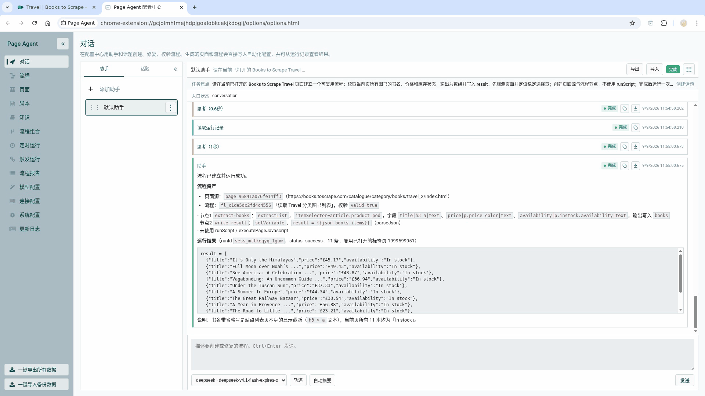

# Page Agent

Page Agent 是一个基于 Chromium Manifest V3 的页面自动化扩展。它把自然语言对话、人工操作和页面事实组织成可编辑、可重复运行的 Flow，并提供运行记录、触发器、知识和 MCP/ARP/1 资源接口。

当前版本：`1.0.0`

## 从对话到可复用的产出

Page Agent 的核心路径是：说清楚页面目标，先观测当前页面，再生成可编辑、可重复运行的 Flow。

下面的真实示例以 Books to Scrape 的 Travel 页面为输入，让 Agent 读取 11 本书的书名、价格和库存状态，并把结果写入 `result`。



演示只保留四个关键结果：对话明确任务，Flow 把页面选择器和数据处理步骤结构化，Flow 列表把它保存为可复用资产，运行报告则验证最终结果。

重点不是浏览所有功能页面，而是展示一次自然语言请求如何变成可以再次运行和继续编辑的产出。

## 能力范围

- 在真实网页中读取页面、执行操作并提取结果
- 通过对话创建和维护可复用 Flow、脚本与页面配置
- 手动、定时或 URL 触发 Flow，并查看运行报告
- 连接 OpenAI Chat/Responses、Anthropic Messages 及兼容服务
- 可选运行 MCP Server，通过 ARP/1 资源协议供外部 Agent 调用

## 已完成模块

✅ Chromium Manifest V3 扩展与 Side Panel

✅ 页面感知、定位、动作执行和结果验证

✅ Flow / FlowGroup 编排、模板、数据处理和断点运行

✅ 对话 Agent、多个模型协议 Provider、流式输出和工具调用

✅ 页面、浏览器、Flow、运行、报告、知识、Skill、助手和模型服务资源路由

✅ ARP/1 协议与可选 MCP Server（stdio、WebSocket、HTTP webhook）

✅ 定时任务、URL 触发、并发控制、取消和会话恢复

✅ Conversation Journal、运行报告、配置备份与恢复

✅ 页面录制、回放素材、截图

## 安装扩展

项目当前以源码目录形式分发。需要 Chromium 114 或更高版本（使用 Manifest V3 Side Panel API）。

1. 克隆仓库。
2. 打开 `chrome://extensions` 或 `edge://extensions`，启用开发者模式。
3. 点击“加载已解压的扩展程序”，选择仓库根目录（该目录应直接包含 `manifest.json`）。
4. 点击扩展图标打开侧边栏，在配置中心填写模型服务；API Key 仅保存于本地浏览器存储。

安装与打包说明见 [`docs/Page-Agent-00-安装与打包.md`](docs/Page-Agent-00-安装与打包.md)。

## 可选 MCP Server

MCP Server 位于 [`mcp-server/`](mcp-server/)，扩展本体不依赖它。它通过 WebSocket 连接扩展，并向 MCP 客户端暴露 `GET`、`POST`、`PUT`、`PATCH`、`DELETE`、`OPTIONS` 六个方法工具。

```bash
cd mcp-server
npm install
npm start
```

默认监听 WebSocket `127.0.0.1:9999` 和 HTTP `127.0.0.1:9998`。单文件发布包可用 `npm run build:single` 生成，配置和接口见 [`docs/Page-Agent-11-MCP服务.md`](docs/Page-Agent-11-MCP服务.md)。

## 打包

根目录的 [`page-agent-build.sh`](page-agent-build.sh) 会同步内置资源，按文件压缩 JavaScript/CSS，并生成可加载的 ZIP。脚本不会生成 CRX，也不会混淆代码：

```bash
./page-agent-build.sh
```

打包前需要安装 Node.js、npm、`rsync` 和 `zip`，并分别在根目录及 `mcp-server/` 安装依赖。输出位于 `dist/`，该目录已被 Git 忽略。

## 项目结构

| 路径 | 用途 |
| --- | --- |
| `manifest.json`、`background.js`、`content/`、`options/`、`sidepanel/` | Chromium 扩展运行时 |
| `agent/`、`flows/`、`resources/`、`shared/` | Agent、Flow 和 ARP/1 核心 |
| `mcp-server/` | 可选 Node.js MCP 传输服务 |
| `dependencies/` | 随扩展分发的浏览器端第三方运行时 |
| `builtin-flows/`、`builtin-skills/` | 内置 Flow 和 Skill |
| `docs/` | 安装、协议、兼容性和分发说明 |

## 权限与数据

扩展声明了 `<all_urls>`、cookies、downloads、proxy、debugger 和 nativeMessaging 等高权限，因为页面自动化和文件动作需要这些能力。请只在信任的浏览器配置中安装，并审阅 Flow、外部模型和 MCP 连接配置。录制、页面内容、URL 参数及模型请求可能包含敏感信息；项目不会替用户自动脱敏。

## 依赖与许可证

项目使用 Apache License 2.0。直接依赖及其许可证见 [`THIRD_PARTY_NOTICES.md`](THIRD_PARTY_NOTICES.md)；随源码分发的第三方许可证/声明保存在对应依赖目录中。使用前请阅读 [`DISCLAIMER.md`](DISCLAIMER.md)。

## 致谢

感谢 [Linux.do](https://linux.do/) 社区以及各位佬友的经验分享。

## 联系与协作

公开联系邮箱：`harrylee@linux.do`。除该邮箱外，项目不提供任何个人联系方式，不提供商业服务，也不承诺即时响应；这是个人项目，只会在空闲时间维护。

这个项目的代码和文档全部由 AI 工具生成、修改和整理，因此难免存在缺陷和遗漏。遇到问题时，请提供日志、复现步骤和最小示例，便于维护者根据可验证事实协作处理；也请不要把技术问题变成人身攻击或情绪化争论。

问题修复统一采用 GitHub Pull Request 模式。请先阅读 [`docs/Page-Agent-01-贡献与问题反馈.md`](docs/Page-Agent-01-贡献与问题反馈.md)，提交前使用仓库提供的 [Pull Request 模板](.github/pull_request_template.md)。

## 贡献

请先阅读 [`CONTRIBUTING.md`](CONTRIBUTING.md)。安全问题请按 [`SECURITY.md`](SECURITY.md) 的方式报告。
